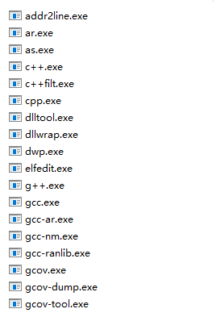
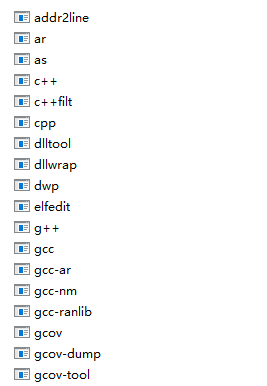
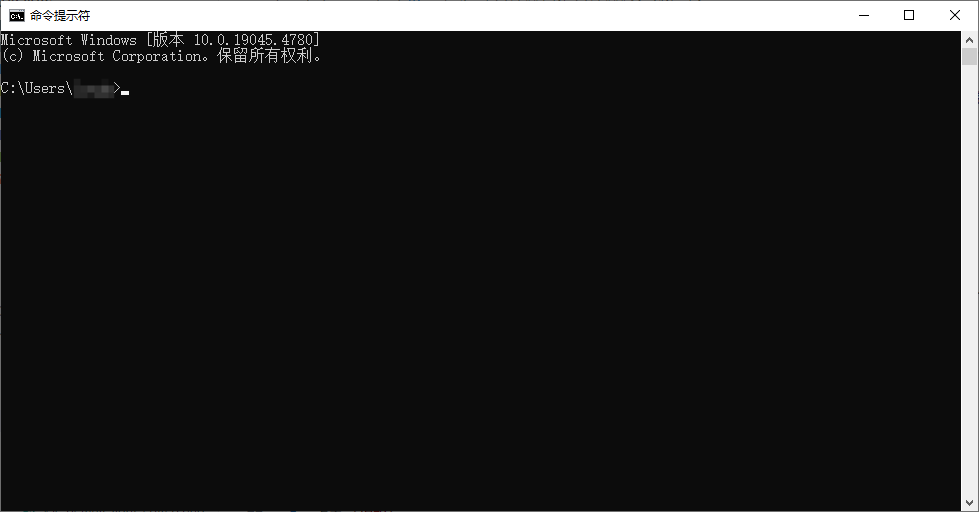
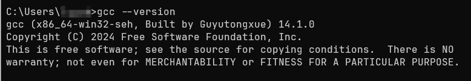
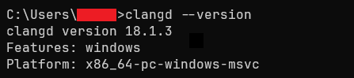
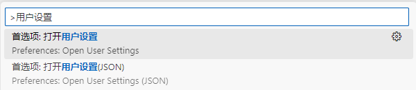
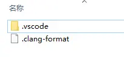

## 前言

本文力求以通俗的方式讲述环境配置。通俗不可避免地会不严谨——这也没法请各位批评指正（雾）。

本文描述的环境配置包含：

1. 编辑器：用来编写和查看纯文本文件的软件，例如 Windows 自带的记事本。本文使用 [Visual Studio Code](https://code.visualstudio.com/)（简称 VS Code）。
::: tip
注意：写字板、Word 不属于纯文本编辑器，而应属于富文本编辑器，不在我们的讨论范围内。
:::
2. 编译器：将源代码翻译为可执行的二进制文件。本文使用 GCC。广义上 GCC 是 C、C++、Objective-C、Fortran、Ada、Go 和 D 等多种语言的编译器（GNU Compiler Collection），狭义上 GCC 仅指 C 语言编译器（GNU C Compiler）。而本文所指的 GCC 介于两者之间：即 C 语言编译器和 C++ 编译器。
3. 调试器：单步执行、打断点等功能，调试程序。本文使用 GDB。
4. 语言服务器：通过语言服务器协议与编辑器交互，提供自动补全、静态分析与代码格式化等功能。本文使用 [clangd](https://clangd.llvm.org/)。

## 安装

### VS Code

前去 [VS Code 官网](https://code.visualstudio.com/)下载并安装，只需要跟着安装程序的提示走就可以了。

::: tip
如果你确实需要高级选项，可以查看 [Running VS Code on Windows](https://code.visualstudio.com/docs/setup/windows/)。
:::

### MinGW-w64

前往 `mingw-builds-binaries` 的 [GitHub Release 页面](https://github.com/niXman/mingw-builds-binaries/releases)，选择文件名中包含 `x86_64`、`posix`、`seh` 和 `ucrt` 的版本。截至本文发布，应该下载 `x86_64-14.2.0-release-posix-seh-ucrt-rt_v12-rev0.7z`。

::: info
根据 [mingw-w64 threads: posix vs win32](https://stackoverflow.com/questions/17242516/mingw-w64-threads-posix-vs-win32)，`posix` 版本将使用 posix API 并允许使用 `std::thread`，`win32` 将使用 win32 API，并禁用 `std::thread` 部分标准。

对于初学者而言，`std::thread` 似乎是无关紧要的。

除了 `mingw-builds-binaries`，也可以考虑[谷雨构建的 MinGW-w64](https://github.com/guyutongxue/mingw-release/releases)，他只提供 `x86_64`、`win32`、`seh` 和 `ucrt`。截至本文发布，应该下载 `gytx_x86_64-14.2.0-win32-seh-ucrt.7z`
:::

::: tip
这两个地址提供的文件均为 `7z` 格式。这是一种压缩包，如果你不知道用什么解压，请使用 [7-Zip](https://www.7-zip.org)。

最新版本的 Windows 11 已经内置 7z 解压功能。
:::

此后，将文件解压缩到一个**合适**的地方，不推荐解压到桌面或“下载”文件夹。要求路径中**不包含中文与空格**。

打开解压缩得到的文件夹，在其中找到 `bin` 子文件夹。文件夹内应该是这样的：



Windows 默认隐藏文件扩展名，所以也可能是这样的：



点击文件资源管理器的地址栏，将这一路径**复制**。接下来，打开 Windows 搜索（快捷键 <kbd>Win</kbd> + <kbd>S</kbd>），输入“环境变量”，点击“编辑系统环境变量”：


::: info
我使用的是 Windows 10 系统。如果你使用 Windows 11 系统，那么 Windows 搜索的界面可能会不同。
:::

打开之后，按如下步骤操作：

1. 点击 `环境变量`；
2. 在 `<你的用户名> 的用户变量` 下点击 `Path`；
3. 点击 `编辑`；
4. 点击 `新建`；
5. 粘贴刚刚复制的路径；
6. 7. 8. 三个 `确定`。


环境变量设置是否正确该如何检查呢？<kbd>Win</kbd> + <kbd>R</kbd> 打开“运行”，输入 cmd 并回车，打开命令行界面：


::: info
我使用的是 Windows 终端（Windows Terminal）。你可能在这一步打开了 Windows 控制台主机（conhost），它应该是这个样子：

:::

输入 `gcc --version` 并回车，如果环境变量配置**正确**，应当看到类似下面的输出：



而如果出现 `'gcc' 不是内部或外部命令，也不是可运行的程序或批处理文件。`，则说明环境变量配置有问题，应当采取的措施包括但不限于：

1. 重启 Windows 终端或 Windows 控制台主机。
2. 重启电脑。
3. 按照上述环境变量配置的步骤，再检查一遍。

### clangd

前往 clangd 的 [GitHub Release 页面](https://github.com/clangd/clangd/releases)，忽略掉“Pre-release”，选择“Latest”的 windows 版本。截至本文发布，应该下载 `clangd-windows-18.1.3.zip`。

这仍然是一个压缩包。与 MinGW-w64 类似，需要在解压缩后，将其中的 `bin` 文件夹添加到环境变量。

输入 `clangd --version` 并回车，如果环境变量配置**正确**，你应当看到类似下面的输出：



此外，也可以直接安装[完整的 LLVM](https://github.com/llvm/llvm-project/releases)，它包含了 clangd。

## 配置

### VS Code 配置

#### 插件安装

- [Chinese (Simplified) (简体中文) Language Pack for Visual Studio Code](https://marketplace.visualstudio.com/items?itemName=MS-CEINTL.vscode-language-pack-zh-hans)：为 VS Code提供中文界面
- [C/C++](https://marketplace.visualstudio.com/items?itemName=ms-vscode.cpptools)：为 VS Code 提供 C/C++ 的调试，自动补全、静态分析与代码格式化。但是我们**只使用调试功能**。
- [clangd](https://marketplace.visualstudio.com/items?itemName=llvm-vs-code-extensions.vscode-clangd)：clangd 插件通过语言服务器协议与 clangd 交互，为 VS Code 提供 C/C++ 的自动补全、静态分析与代码格式化。

#### VS Code 配置

按 <kbd>Ctrl</kbd> + <kbd>Shift</kbd> + <kbd>P</kbd> 打开 VSCode 的命令面板，输入“用户设置”，选择“首选项: 打开用户设置(JSON)”。



这时会自动打开 `settings.json`，此即 VS Code 的配置文件，使用带注释的 JSON 语法（JSON with Comments）。在继续阅读之前，我假定你对这种文件格式有初步的了解。

加入配置项：

```json
{
    "C_Cpp.intelliSenseEngine": "disabled" // [!code ++]
}
```

关闭 C/C++ 插件的自动补全（因为我们要用 clangd）。

#### 工作区

你需要用 VS Code 打开一个**文件夹**作为你的**工作区**。如果你是初学者，习惯于单文件编译/运行，那么我推荐你找一个恰当的位置新建文件夹。如果你正在进行一些项目，那项目文件夹就是你的工作区。

::: tip
有关工作区的更详细的信息，请参考 VS Code 文档：

- [What is a VS Code "workspace"?](https://code.visualstudio.com/docs/editor/workspaces)
- [Multi-root Workspaces](https://code.visualstudio.com/docs/editor/multi-root-workspaces)
:::

#### 工作区配置

为了正确地对单个 C/C++ 源文件编译与调试，需要两个配置文件。

在工作区中新建 `.vscode` 文件夹，然后在其中新建 `launch.json` 和 `tasks.json`。

##### `tasks.json`

`tasks.json` 是构建说明，指导 C/C++ 插件怎样启动编译器。这里给出的是我自己使用的配置：

```json
{
    "tasks": [
        {
            "type": "process",
            "label": "Compile-g++",
            "command": "g++",
            "args": [
                "-std=c++20",                 // 使用 C++ 20 标准
                "-g",                         // 生成调试信息
                "-m64",                       // 生成 64 位程序
                "-Wall",                      // 启用所有警告
                "-Wextra",                    // 启用额外警告
                "-fdiagnostics-color=always", // 输出彩色诊断信息
                "-o",
                "${fileDirname}\\${fileBasenameNoExtension}.exe",
                "${file}"
            ],
            "options": {
                "cwd": "${fileDirname}"
            },
            "problemMatcher": [
                "$gcc"
            ],
            "group": {
                "kind": "build",
                "isDefault": true
            },
            "presentation": {
                "echo": false,
                "reveal": "always",
                "focus": false,
                "panel": "shared"
            },
            "detail": "Compiler: g++"
        }
    ],
    "version": "2.0.0"
}
```

##### `launch.json`

`launch.json` 是调试说明，指导 C/C++ 插件怎样启动调试器。这里给出的是我自己使用的配置：

```json
{
    "configurations": [
        {
            "name": "g++",
            "type": "cppdbg",
            "request": "launch",
            "program": "${fileDirname}\\${fileBasenameNoExtension}.exe",
            "args": [],
            "stopAtEntry": false,
            "cwd": "${fileDirname}",
            "environment": [],
            "externalConsole": false,
            "MIMode": "gdb",
            "internalConsoleOptions": "neverOpen",
            "miDebuggerPath": "gdb",
            "setupCommands": [
                {
                    "description": "Enable pretty-printing for gdb",
                    "text": "-enable-pretty-printing",
                    "ignoreFailures": true
                }
            ],
            "preLaunchTask": "Compile-g++"
        }
    ],
    "version": "2.0.0"
}
```

更复杂的配置可以参考 [Using GCC with MinGW](https://code.visualstudio.com/docs/cpp/config-mingw)。

### clangd 配置

#### clang-format 配置

clangd 集成有 clang-format，这是 C/C++ 等语言的格式化工具。例如：

::: code-group

```cpp [格式化前]
// 代码取自 https://github.com/Elkeid-me/csapp-3e-proxy-lab/blob/main/src/cache.cpp#L56
std::pair<std::shared_ptr<char[]>,std::size_t>cache::find_cache(const std::string&uri)
    { std::shared_lock
  lock(mtx);
  if (auto it{map.find(uri)};it!=map.end()){auto[ptr,size,_]{it->second};
it->second.stamp=++clock;
  return{ptr,size};
        } return {nullptr, 0};}
```

```cpp [格式化后]
// 代码取自 https://github.com/Elkeid-me/csapp-3e-proxy-lab/blob/main/src/cache.cpp#L56
std::pair<std::shared_ptr<char[]>, std::size_t>
cache::find_cache(const std::string &uri)
{
    std::shared_lock lock(mtx);
    if (auto it{map.find(uri)}; it != map.end())
    {
        auto [ptr, size, _]{it->second};
        it->second.stamp = ++clock;
        return {ptr, size};
    }
    return {nullptr, 0};
}
```
:::

为了使用 clang-format，你需要在工作区根目录下有名为 `.clang-format` 的配置文件：



这个文件使用 YAML 语法。这里给出我使用的配置文件：

```yaml
BasedOnStyle: LLVM
UseTab: Never
IndentWidth: 4
TabWidth: 4
BreakBeforeBraces: Allman
AllowShortIfStatementsOnASingleLine: false
IndentCaseLabels: false
ColumnLimit: 800
AccessModifierOffset: -4
NamespaceIndentation: All
FixNamespaceComments: false
IndentPPDirectives: AfterHash
PPIndentWidth: 1
```

详细说明请见官方文档 [Clang-Format Style Options](https://clang.llvm.org/docs/ClangFormatStyleOptions.html)。你可以自行调配符合你口味的代码风格。

#### clangd

终于到了最复杂的部分——clangd 本体的配置。对于初学者（单文件编译），请看 [`.clangd`](#clangd-2)；如果你正在使用某种构建工具，请看 [`compile_commands.json`](#compile-commands-json)。

##### `.clangd`

`.clangd` 记录了你在编译文件时使用的编译器、编译参数等。`.clangd` 在工作区根目录下——换句话说，它应该跟 `.clang-format` 在一起。

这个文件使用 YAML 语法。这里给出我使用的配置文件：

```yaml
CompileFlags:
  Compiler: g++
  Add: [-std=c++20, -m64, -Wall, -Wextra, --target=x86_64-w64-windows-gnu]
```

详细说明请见官方文档 [Configuration](https://clangd.llvm.org/config)。

##### `compile_commands.json`

`compile_commands.json` 是一个 JSON 文件，指定项目中每个源代码编译的方式。典型的 `compile_commands.json` 如下：


`compile_commands.json` 可以人工编写，但更推荐的方式是用工具自动生成。请选择你的构建工具：

- [CMake](#cmake)
- [Xmake](#xmake)
- [GNU make](#gnu-make)

::: tip
如果你不明白什么是构建工具，那么很显然，你应该使用 [`.clangd`](#clangd-2)。

详细信息见 [Project setup](https://clangd.llvm.org/installation#project-setup)。
:::

##### CMake

在运行 CMake 时加入参数 `-DCMAKE_EXPORT_COMPILE_COMMANDS=1`。

也可以在 `CMakeLists.txt` 中加入：

```cmake
set(CMAKE_EXPORT_COMPILE_COMMANDS ON)
```
::: tip
参考：

- [CMAKE_EXPORT_COMPILE_COMMANDS](https://cmake.org/cmake/help/latest/variable/CMAKE_EXPORT_COMPILE_COMMANDS.html)
:::
如果 `compile_commands.json` 被生成在项目根目录，或 `项目根目录/build`，clangd 可以自动识别。否则，你需要手工移动 `compile_commands.json` 到项目根目录。

只有在生成 Makefile 或 Ninja 时，CMake 才会生成 `compile_commands.json`。

##### Xmake

[Xmake](https://xmake.io/#/zh-cn/) 是一个基于 Lua 的轻量级跨平台构建工具。

要使用 Xmake 生成 `compile_commands.json`，可以直接运行：

```console
xmake project -k compile_commands
```
也可以在 `xmake.lua` 中加入：

```lua
add_rules("plugin.compile_commands.autoupdate")
```

来自动更新 `compile_commands.json`。

::: tip
参考：

- [生成 compile_commands](https://xmake.io/#/zh-cn/plugin/builtin_plugins?id=%e7%94%9f%e6%88%90compile_commands)
- [plugin.compile_commands.autoupdate](https://xmake.io/#/zh-cn/manual/custom_rule?id=plugincompile_commandsautoupdate)
:::
##### GNU make

GNU make 无法自动生成 `compile_commands.json`。不过嘛，有一个网站 [Generate Compilation Database from GNU make output online](https://texttoolkit.com/compilation-database-generator) 可以根据 `make` 的输出生成 `compile_commands.json`。具体来说，你需要：

1. 确保 make 输出的是英文。对于 Ubuntu，可能需要运行
   ```console
   LANG=en_US.UTF-8
   ```
2. 运行
   ```console
   make -nw
   ```
3. 将 2. 的输出粘贴到上述网站。点击 `Generate!` 即可获得 `compile_commands.json`。

此外，clangd 官方推荐使用 [Bear](https://github.com/rizsotto/Bear) 为基于 make 或其他构建工具的项目生成 `compile_commands.json`。
