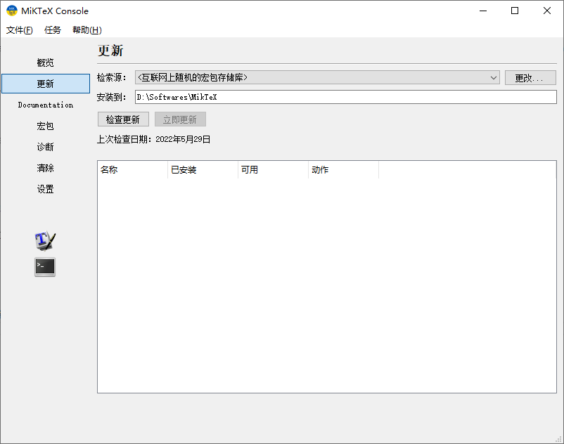
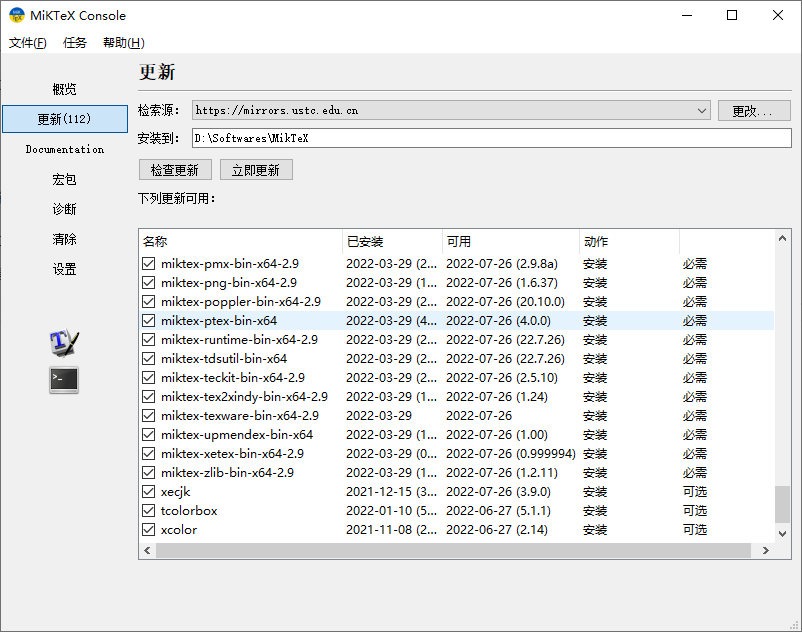

::: warning
作者已经滚去用 [TinyTeX](https://yihui.org/tinytex/) 了。
:::

::: info
> 计科人认为计算机技术的那个源头，它是什么？它是 Technique，对吧。所以这个词叫 TeX。我经常说 TeX 这个词有秘密。TeX，Technique 了吗？TeX 嘛。它真 Technique 吗？TeX。到底 Technique 没 Technique？TeX。我问 TeX，它真 Technique 了吗？TeX。你看看，Technique 没 Technique？TeX。它很厉害，它不是一个有形的。

> 所以你读 The TeXbook，The TeXbook 里面讲什么，it's supposed to be a panacea that satisfies everybody, at the risk of satisfying nobody. The category code for any character can be changed at any time, but it is usually wise to stick to a particular scheme. 所以，优雅的计算机排版生于 TeX，TeX 生于无。是这样说的吧，它不是个实体。

> 我有一次去下北泽讲课，遇到一个人，他的老师，当时有七十多岁了。那个七十多岁的老人家，就问那个小伙子他，说真有中文编程吗？这个世界真有中文编程吗？一下子把小伙子问傻了。有。他说真有吗？一下就问傻了。你想想那是个软件，软件是无相的。所以 The LaTeX3 Interfaces 的一句话，叫 the colon and underscore are treated as "letters". 见字母非字母，那是个软件，你不能迷信。
:::

## 你真的需要 LaTeX 吗？

LaTeX 就是个排版工具。如果你用 Word 之类的足够熟练，那其实没有必要学 LaTeX。

从美观角度考虑，我是推荐大家学 LaTeX 的。此外，我也建议高中老师学习 LaTeX。毕竟，数学排版有 amsmath 等包；化学式、结构式与化学方程式有 mhchem 和 chenfig 等包：美观的试题排版对提升学习积极性是十分必要的……而除了理科试题，其他学科的试卷和讲义在自动化排版方面都可以使用 LaTeX，这比 Word 手动调要好多了。

## 不安装指南

首先，你可以看自己的学校是否在校园网部署了在线 LaTeX。例如：

- [北京大学 LaTeX](https://latex.pku.edu.cn/)
- [清华大学 LaTeX](https://overleaf.tsinghua.edu.cn)
- [南京大学 LaTeX](https://tex.nju.edu.cn/)

如果校园网没有，可以考虑：

- [Overleaf](https://www.overleaf.com/)
- [TeXPages](https://texpage.com/)

甚至使用 Github Actions 也可以编译。

但是，本地编译仍然有不可替代的优势，万一在线服务崩了呢？

## TeX 发行版介绍

[MiKTeX](https://miktex.org/) 是一个滚动更新的发行版，支持 Windows、Linux 和 macOS。其控制台和包管理器带有友好的图形界面，且对于宏包支持即用即装（“Install on fly”）。目前我电脑上的 MiKTeX 仅占用 0.98 GB 空间，这远小于 TeX Live 的 5 GB。

多年未更的 [CTeX](https://ctex.org/) 套装也在今年更新了 3.0 正式版，目前基于 MiKTeX 20230420 二次打包，同时加入 CCT，TY 等上古时期的中文排版系统（因为还有中文期刊要用它们）。可以一试。

[TeX Live](https://tug.org/texlive/) 由 TeX 用户组推出，每年更新，如今是 TeX Live 2023。支持 Windows、Linux 和 Unix，在 macOS 上有 MacTeX。其问题是包管理器的图形界面实在是太不友好了（悲），而且每年封装完镜像之后，新发布的包只能等待第二年再封装。例如：2022 年发布的 [fixdif](https://ctan.org/pkg/fixdif) 包只能等 2023 年的 TeX Live 镜像，或者使用命令 `tlmgr install fixdif` 手动安装。但如果使用 MiKTeX，你只需在文档中使用 `\usepackage{fixdif}`，在编译时，会自动安装缺少的包。

鉴于 TeX Live 的体积过大、控制台不友好、以及调用系统字体时出现的奇奇怪怪的问题，我更推荐 MiKTeX。但是，如果存在（但不限于）以下情况，请使用 TeX Live。

1. 由于网络原因，你无法连接到 MiKTeX 的服务器（因而无法更换检索源，无法安装宏包）。
2. 你需要使用 pTeX-ng 等仅包含于 TeX Live 的引擎。

## MiKTeX 安装（Windows）

可以前去 [CTAN/MiKTeX | 清华大学开源软件镜像站](https://mirrors.tuna.tsinghua.edu.cn/CTAN/systems/win32/miktex/setup/windows-x64/)下载。选择 `basic-miktex-xx.x-x64.exe`，截至本文发布，你应当选择 `basic-miktex-23.4-x64.exe`。

我想安装程序大家应该都会，在此不过多赘述。只指出一点：**不要选择**为所有用户安装。

## 配置 MiKTeX 源与更新宏包

在开始菜单中找到 MiKTeX Console，在左侧选择“更新”

_MiKTeX Console_

此时，“检索源”是 `<互联网上的随机存储库>`。强烈建议点击右侧的“更改”，切换到一个国内的源，例如清华源或者科大源。然后，点击“检查更新”：

_MiKTeX Update_

点击“立即更新”。

首次安装的 MiKTeX 必须进行更新。同时，建议一段时间更新一次宏包。

更新时，可能提示：

```
The remote package repository is outdated. You have to choose another repository.
```

此时换一个镜像源即可。

## 使用什么编辑器？

MiKTeX 自带 TeXworks。TeXstudio 和 VS Code 是很多人的选择。Vim 与 Emacs 亦可。

对于 VS Code，你可以安装 [LaTeX Workshop](https://marketplace.visualstudio.com/items?itemName=James-Yu.latex-workshop) 或者 [TexLab](https://marketplace.visualstudio.com/items?itemName=efoerster.texlab)。以下给出我个人的 LaTeX Workshop 配置。

```json
{
    "latex-workshop.latex.autoBuild.run": "never",
    "latex-workshop.latex.autoBuild.cleanAndRetry.enabled": false,
    "latex-workshop.latex.tools": [
        {
            "name": "lualatex",
            "command": "lualatex",
            "args": [
                "-synctex=1",
                "-interaction=nonstopmode",
                "-file-line-error",
                "%DOCFILE%"
            ]
        },
        {
            "name": "biber",
            "command": "biber",
            "args": [
                "%DOCFILE%"
            ]
        }
    ],
    "latex-workshop.latex.recipes": [
        {
            "name": "LuaLaTeX",
            "tools": [
                "lualatex"
            ],
        },
        {
            "name": "LuaLaTeX with Biber",
            "tools": [
                "lualatex",
                "biber",
                "lualatex",
                "lualatex"
            ]
        },
    ]
}
```
