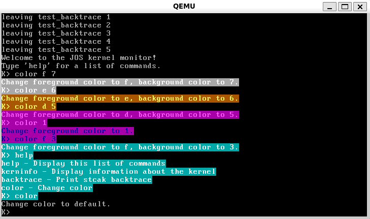

选择了唯一的 Challenge。

## Exercise 2

BIOS 在初始化 `%ss` 与 `%esp` 寄存器，并通过一系列 `in`/`out` 指令设置输入输出。

## Exercise 3

### Question 1

执行 `ljmp $PROT_MODE_CSEG, $protcseg` 后进入 32 位代码。

这是通过 `seta20.1` 和 `seta20.2` 打开 A20，并切换到保护模式实现的。

### Question 2

bootloader 的最后一条指令是 `call *0x10018`，对应着 `bootmain()` 函数的 `((void (*)(void))(ELFHDR->e_entry))()` 语句。

内核的第一条指令是 `movw $0x1234,0x472`。

### Question 3

内核的第一条指令位于 `0x10000c`。

### Question 4

在 `bootmain` 函数中，读取 elf 文件头。然后，根据 elf 文件头的信息，去读取各个程序段头。最终，通过程序段头的 `memsz` 信息，获知每个程序段的大小，并以此在 `readseg()` 函数算出扇区数。

## Exercise 5

第一条执行错误的指令是 `lgdt gdtdesc`。

第一条“break”的指令是 `ljmp $PROT_MODE_CSEG,$protcseg`，也即 `ljmp $0x8,$0x7c36`。

因为这一行指令不是位置无关代码，而 `protecseg` 链接到了错误的位置。

## Exercise 6

bootloader 的 `bootmain()` 函数的 `for` 循环的第一次运行，会读取内核 `.text` 段的前 29058 字节到 `0x100000`。这 8 个字即是内核 `.text` 段的前 8 个字。

## Exercise 7

指令 `jmp *%eax` 会发生异常。

## Exercise 8

在 `lib/printfmt.c` 文件中有一 `vprintfmt()` 函数，其中 `switch` 的 `case 'o'` 修改如下：

```c
case 'o':
    num = getuint(&ap, lflag);
    base = 8;
    goto number;
```

### Question 1

在 `kern/printf.c` 和 `kern/console.c` 之间的接口是 `cputchar()` 函数。具体来说，是这样的：


1. `kern/console.c` 中的 `cputchar()` 函数实质上是 `cons_putc()` 的套壳。后者在控制台中输出一个字符。
2. `kern/printf.c` 中有 `putch()` 函数，实质上是 `cputchar()` 的套壳。
3. putch()` 的函数指针作为 `vprintfmt()` 的第一个参数。后者又被 `vcprintf()` 调用。
4. `vcprintf()` 又被 `cprintf()` 调用。

### Question 2

在已输出的字符数大于 `CRT_SIZE` 时，将屏幕滚动一行。

### Question 3

1. 参数 `fmt` 指向格式化字符串 `"x %d, y %x, z %d\n"`；`ap` 指向变参结构体。
2.
```text
cprintf()
    vcprintf()
        cons_putc('x')
        cons_putc(' ')
        va_arg(), ap 由指向 x 变为指向 y
        cons_putc('1')
        cons_putc(',')
        cons_putc(' ')
        cons_putc('y')
        cons_putc(' ')
        va_arg(), ap 由指向 y 变为指向 z
        cons_putc('3')
        cons_putc(',')
        cons_putc(' ')
        cons_putc('z')
        cons_putc(' ')
        va_arg(), ap 由指向 z 变为指向我们不知道的东西
        cons_putc('4')
        cons_putc('\n')
```

### Question 4

输出 `He110 World`。具体过程如下：

1. 输出 `H`。
2. 输出 `57616` 的十六进制 `e110`。
3. 输出 `Wo`。
4. `i` 在小端序机器上，地址从低到高为 4 个字节：`0x72 0x6c 0x64 0x00`，（在 ASCII 码）恰好可以视为长度为 3 的空终止字符串 `rld`。又考虑到格式化字符串中的转换说明 `%s`，这一步输出 `rld`。
    如果是大端序，那么 `i` 应当设为 `0x726c6400`。`57616` 不必改变。

### Question 5

将会输出我们不知道的值。具体来说，如果参数 `3` 的地址为 `byte *ptr`，则会输出 `ptr + 4` 指向的，类型为 `int` 的值。

解释：在当前 ABI 中，函数参数全部使用栈传参，且从右向左压栈。因此，在输出 `x=` 后，`va_arg` 会获取值 `3`，并将变参列表指针 `ap` 向上移动 4 字节。在输出 `y=` 后，`va_arg` 会获取 `ptr + 4` 指向的值。

### Question 6

`cprintf(..., const char *fmt)`，其中可变参数需要倒着输入。例如，为了输出 `x` 和 `y` 的值，需要：

```c
cprintf(y, x, "x=%d, y=%d");
```

## Exercise 9

在 `kern/entry.S` 的 `relocated` 函数中，有一行指令：

```
movl   $(bootstacktop),%esp
```

在此初始化内核栈。

在 `.data` 段中，静态地保留了 `KSTKSIZE` 大小的空间作为内核栈。

栈指针初始化时，指向上述空间的最高处。

## Exercise 10

分别是参数 `x - 1`，返回地址、`%ebp` 和 `%esi`。共计 4 个 32位字。

## Exercise 11 and 12

对于 `mon_backtrace` 编写如下：

```c
int mon_backtrace(int argc, char **argv, struct Trapframe *tf)
{
    struct Eipdebuginfo debug_info;
    cprintf("Stack backtrace:\n");

    uint32_t *ebp = (uint32_t *)read_ebp();
    while ((uint32_t)ebp != 0)
    {
        uint32_t eip = *(ebp + 1), arg_1 = *(ebp + 2), arg_2 = *(ebp + 3),
                    arg_3 = *(ebp + 4), arg_4 = *(ebp + 5), arg_5 = *(ebp + 6);
        cprintf("  ebp %08x  eip %08x  args %08x %08x %08x %08x %08x\n", ebp,
                eip, arg_1, arg_2, arg_3, arg_4, arg_5);

        debuginfo_eip(eip, &debug_info);

        cprintf("         %s:%d: %.*s+%d\n", debug_info.eip_file,
                debug_info.eip_line, debug_info.eip_fn_namelen,
                debug_info.eip_fn_name, eip - debug_info.eip_fn_addr);
        ebp = (uint32_t *)(*ebp);
    }
    return 0;
}
```

第 6 行用于获取当前的 `%ebp`。

`while` 循环的终止条件是 `%ebp == 0`，因为 `relocated` 的 `%ebp` 为 0。

第 9 ~ 12 行是获取和打印 `%eip` 以及 5 个参数的过程。

第 14 ~ 18 行是获取和打印 `%eip` 以及 5 个参数的过程。

第 19 行用于获取上一层函数的 `%ebp`，因为这一层函数的第一个语句即是 `push %ebp`。

再在 `debuginfo_eip` 补充如下的代码，用于获取对应的行号：

```c
stab_binsearch(stabs, &lline, &rline, N_SLINE, addr);

if (lline <= rline)
    info->eip_line = lline;
else
    info->eip_line = -1;
```

## Challenge

为了在 VGA 字符模式向屏幕打印字符，我们必须将它写入硬件提供的 VGA 字符缓冲区。VGA 字符缓冲区中的每一个字符单元为 2 字节，有如下的格式：

|位|值含义|
|:--:|:---:|
|  0 ~ 7|字符 ASCII 码|
| 8 ~ 11|前景色       |
|12 ~ 14|背景色       |
|     15|闪烁         |

可以在 `kern/console.c` 中的 `cga_putc()` 函数看到如下语句：

```c
if (!(c & ~0xFF))
    c |= 0x700;
```
此即硬编码的黑底白字。为了更改输出颜色，我添加了一个 `color` 命令，类似 Windows 的 `COLOR` 命令，支持以下三种输入：

1. `color` 恢复默认的黑底白字。
2. `color <fg color>` 改变前景色。`<fg color>` 的值可以为 0 ~ f。
3. `color <fg color> <bg color>` 改变前景色和背景色。`<fg color>` 的值可以为 0 ~ f，`<bg color>` 的值可以为 0 ~ 7。

`color` 命令会检查参数是否合法，并保证前景色与背景色不同。

`color` 命令的详细实现见代码。这里只说思路：

1. 加入全局变量 `fg_color`, `bg_color`，并将硬编码的黑底白字修改为：

```c
if (!(c & ~0xFF))
    c |= (fg_color << 8) | (bg_color << 12);
```
2. 使用 `color` 命令修改全局变量 `fg_color`, `bg_color`。

效果如图：

_`color` 命令_
