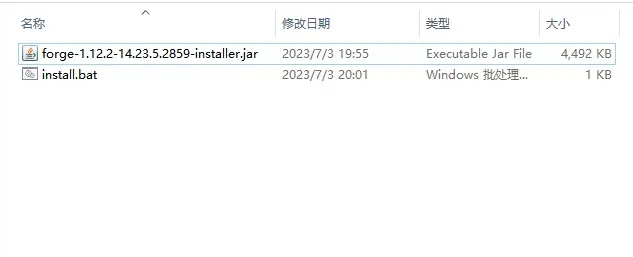
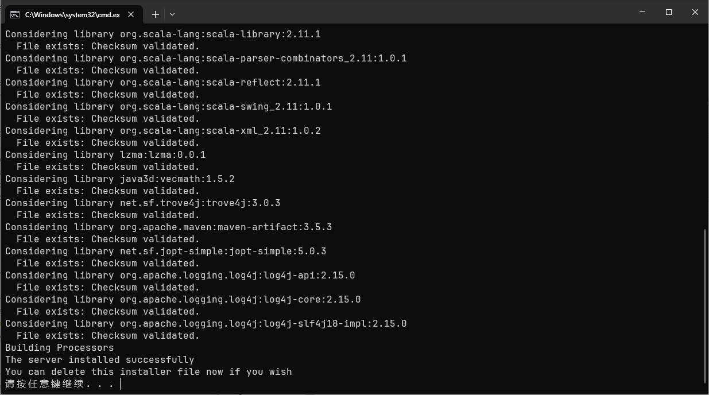
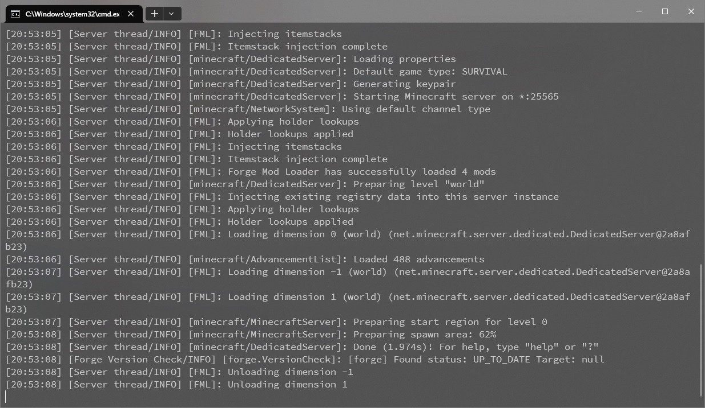

::: info
对于新版本，请考虑NeoForge。在本文更新的三小时前，Sponge合并了支持NeoForge的PR。
:::

这篇文章将简要介绍Forge服务器的搭建。Forge服务器有多种服务端软件，在本文中只会介绍其中一种。

本文以1.12.2版本为例。

::: warning
长期以来，笔者只游玩原版MC，对模组不甚熟悉。因此，本文内容较为简略，且可能有诸多错误。
:::

::: tip
阅读本文之前，建议先阅读[架设自己的Minecraft服务器](/posts/setup-a-paper-server)，并确保安装了恰当的Java。对于1.12.2版本，你需要Java 8。
:::

## 下载与安装Forge

前往[Forge下载页](https://files.minecraftforge.net/net/minecraftforge/forge/)下载对应版本的安装器。例如，我下载了`forge-1.12.2-14.23.5.2859-installer.jar`。

将下载的`.jar`文件移动到一个空文件夹，在同一个文件夹下新建`install.bat`文件。此时文件夹里应该是这样：



右键编辑`install.bat`，写入以下内容：

```bat
@ECHO OFF
java -jar "<安装器的文件名>" --installServer
pause
```

如果你没有把Java运行时添加到PATH，那么第二行的`java`可以替换为Java运行时的完整路径，例如：

```bat
@ECHO OFF
"C:\Program Files\Java\jre-1.8\bin\java.exe" -jar forge-1.12.2-14.23.5.2859-installer.jar --installServer
pause
```

::: warning
在文章[架设自己的Minecraft服务器](/posts/setup-a-paper-server)中，我提到了OpenJ9。相比HotSpot，OpenJ9声称自己启动更快、更省内存。然而，早期的一些尝试表明，Forge/NeoForge无法与OpenJ9兼容。我们在：
- Minecraft 1.20.4
- NeoForge 20.4.237
- OpenJ9 0.48.0（IBM Semeru，OpenJDK 21.0.5）

进行测试，无法运行，并提示使用HotSpot。我们没有测试更高的版本。一些报告[^1]表明新版本NeoForge似乎支持OpenJ9。
:::

而后运行`install.bat`。以下的输出是我使用1.12.2版本得到的。你得到的输出应当与我大同小异：



当最终出现

```
The server installed successfully
You can delete this installer file now if you wish
```
时，则证明安装成功。此时，你可以删除`install.bat`和安装器。

::: tip
下载失败？在`-jar`前加两个妙妙参数：
```bash
-DsocksProxyHost=localhost -DsocksProxyPort=<Clash Socks5端口号>
```
:::

## 启动服务器

如果你使用新版本的MC，那么文件夹下已经包含了`run.bat`（用于在Windows下启动服务器），即可。

如果你使用旧版本的MC，例如本教程中的1.12.2，我们需要自己写一个`run.bat`。写入以下内容：

```bat
@ECHO OFF
java -Xms2G -Xmx2G -jar <forge文件名> nogui
pause
```

多数情况下，我建议将java替换为完整的java路径。例如：

```bat
@ECHO OFF
"C:\Program Files\Java\jre-1.8\bin\java.exe" -Xms2G -Xmx2G -jar forge-1.12.2-14.23.5.2859.jar nogui
pause
```

这里，`-Xms2G -Xmx2G`意味着将服务器的内存限制在2 GB。你也可以使用形如`-Xms4G -Xmx4G`、`-Xms3500M -Xmx3500M`等参数。Forge官方建议内存不小于4 GB（但是我3 GB也玩的很愉快）

现在，运行`run.bat`。命令行窗口会弹出提示，要求你修改`eula.txt`。根据文章[架设自己的Minecraft服务器](/posts/setup-a-paper-server)修改即可。

关闭命令行窗口，再次运行`run.bat`即可。



## 如何联机？

1. 使用本机的公网IPv4或IPv6地址。
2. 使用端口映射软件，如[SakuraFrp](https://www.natfrp.com/)
3. 在财力与技术允许的情况下，租一台服务器。如腾讯云的2核心4 GB内存轻量应用服务器、Azure的B2s虚拟机等[^2]。

[^1]: https://github.com/neoforged/NeoForge/issues/81
[^2]: Azure中国版仅限企业或组织用户。个人用户只能使用Azure国际版，无法使用中国大陆的数据中心。
