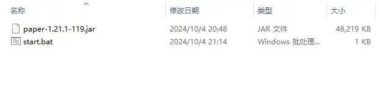
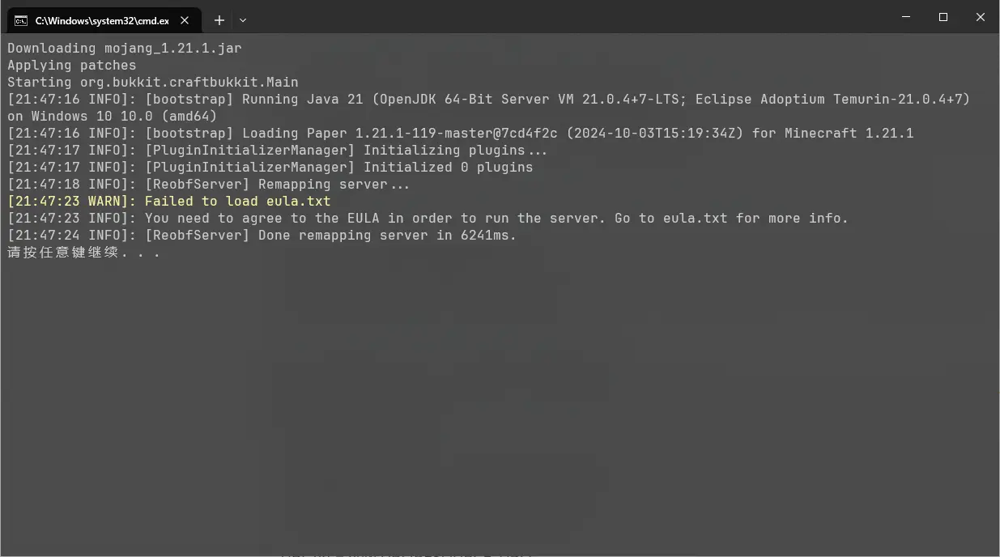
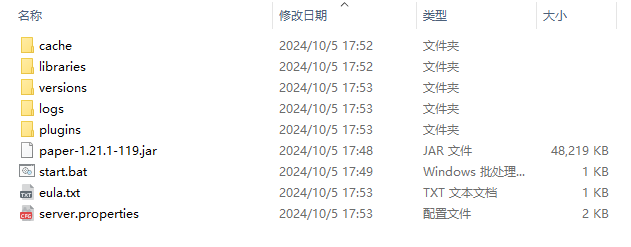
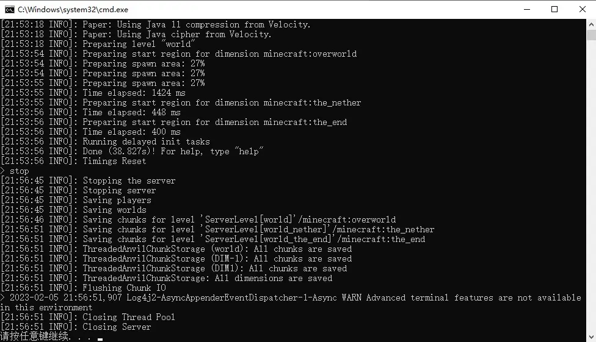

这篇文章呢，是受同学委托所写。本来打算一次性写完 Forge 服务器、Fabric 服务器和原版服务器的架设方法，但是考虑到我咕咕咕的能力（雾）和篇幅限制，还是先只写原版服务器的架设方法罢。

在继续阅读之前，建议先阅读 [Minecraft 最终用户许可协议（EULA）](https://www.minecraft.net/zh-hans/eula)。

## Why Paper?

众所周知，即便是 MC 原版服务器，也有很多不同的服务端。那为什么选择 Paper 呢？

1. 官方端不支持 Bukkit API。
2. Spigot 不提供预编译的 `.jar` 文件。
3. Paper 有更好的性能，WorldEdit 等插件以 Paper 为首选服务端。

当然，你也可以尝试 [Purpur](https://purpurmc.org/)，这是 Paper 的一个 Fork。

::: warning
默认情况下，Paper 对 MC 原版的特性进行了激进的优化，例如 TNT 复制在 Paper 不生效。对于依赖这些特性的玩家，我的建议是改配置文件，或者去用 Spigot。
:::

## 环境准备

Paper 的 Java 运行时（JRE）要求如下：

|  Paper 版本    | 建议的 Java 版本|
|---------------|---------|
| 1.8 ~ 1.11    | Java 8  |
| 1.12 ~ 1.16.4 | Java 11 |
| 1.16.5        | Java 16 |
| 1.17.1 或更高  | Java 21 |

Paper 官方推荐的 Java 运行时是 [Amazon Corretto](https://aws.amazon.com/corretto/)。这是 Amazon 的 OpenJDK 发行版。

也可以考虑 [Adoptium Temurin](https://adoptium.net)，[Microsoft OpenJDK](https://www.microsoft.com/openjdk) 或 [Azul Zulu](https://www.azul.com/downloads)。

以上是基于 HotSpot 的 Java。你也可以尝试基于 OpenJ9 的 [IBM Semeru Runtime](https://developer.ibm.com/languages/java/semeru-runtimes/)。

::: warning
相比 HotSpot，OpenJ9 声称自己启动更快、更省内存[^1]。但使用 OpenJ9 时，Paper 有概率遇到错误。
:::

## 下载 Paper

最新版本下载（截至本文发稿，是 1.21.1）：[Paper Downloads | PaperMC](https://papermc.io/downloads/paper)

旧版本：[Build explorer | PaperMC](https://papermc.io/downloads/all)。

你将会下载到一个 `.jar` 文件。截至本文发稿，最新的构建是 `paper-1.21.1-119.jar`。

## 架设服务器

将下载的 `.jar` 文件移动到一个空文件夹，在同一个文件夹下新建 `start.bat` 文件。此时文件夹里应该是这样：



右键编辑 `start.bat`，写入以下内容：

```bat
@ECHO OFF
java -Xms2G -Xmx2G -jar <paper 服务端的文件名> --nogui
pause
```

**如果你没有把 Java 运行时添加到 PATH**，那么第二行的 `java` 应替换为 Java 运行时的完整路径，例如：

```bat
@ECHO OFF
"C:\Program Files\jdk-21.0.4\bin\java.exe" -Xms2G -Xmx2G -jar paper-1.21.1-119.jar --nogui
pause
```
::: info
路径带空格的话，要加引号。
`-Xms2G -Xmx2G` 意味着将服务器的内存限制在 2 GB。你也可以使用 `-Xms4G -Xmx4G`、`-Xms3500M -Xmx3500M` 等参数。
:::

而后运行 `start.bat`。以下的输出是我使用 Paper 1.21.1 和 Adoptium Temurin 21.0.4 得到的。你得到的输出应当与我大同小异：



此时文件夹里应当是这样的：

::: tip
下载失败？在 `-jar` 前加两个妙妙参数：
```bash
-DsocksProxyHost=localhost -DsocksProxyPort=<Clash Socks5 端口号>
```
:::



打开 `eula.txt`，将最后一行的 `eula=false` 改为 `eula=true`

::: warning
这意味着你同意 [Minecraft 最终用户许可协议（EULA）](https://www.minecraft.net/zh-hans/eula)。
:::

接下来，你可以修改 `server.properties` 的内容，各项配置的含义可以阅读 [server.properties | Minecraft Wiki](https://minecraft.fandom.com/zh/wiki/Server.properties)。我认为较重要的配置项如下：

|配置项|含义|默认值|
|-----|----|----|
|`enable-command-block`| 是否启用命令方块 | `false` |
|`gamemode`            | 默认游戏模式   | `survival` |
|`max-players`         | 服务器容纳的最多玩家数 | 20 |
|`online-mode`         | 是否启用正版验证      | `true` |

最后，再一次运行 `start.bat` 即可。以下的输出是我使用 Paper 1.21.1 和 Adoptium Temurin 21.0.4 得到的。你得到的输出应当与我大同小异：


现在，在 MC 中添加服务器，地址输入 127.0.0.1 即可。

当需要关闭服务器时，在控制台输入 `stop` 并回车即可。



## 如何联机？

1. 使用本机的公网 IPv4 或 IPv6 地址。
2. 使用端口映射软件，如 [SakuraFrp](https://www.natfrp.com/)
3. 在财力与技术允许的情况下，租一台服务器。如腾讯云的 2 核心 4 GB 内存轻量应用服务器、Azure 的 B2s 虚拟机等[^2]。

[^1]: [Eclipse OpenJ9 performance](https://eclipse.dev/openj9/performance/)，注意此网站可能过时。
[^2]: Azure 中国版仅限企业或组织用户。个人用户只能使用 Azure 国际版，无法使用中国大陆的数据中心。
