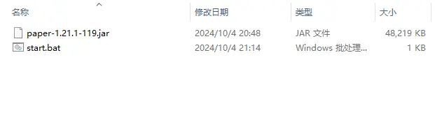
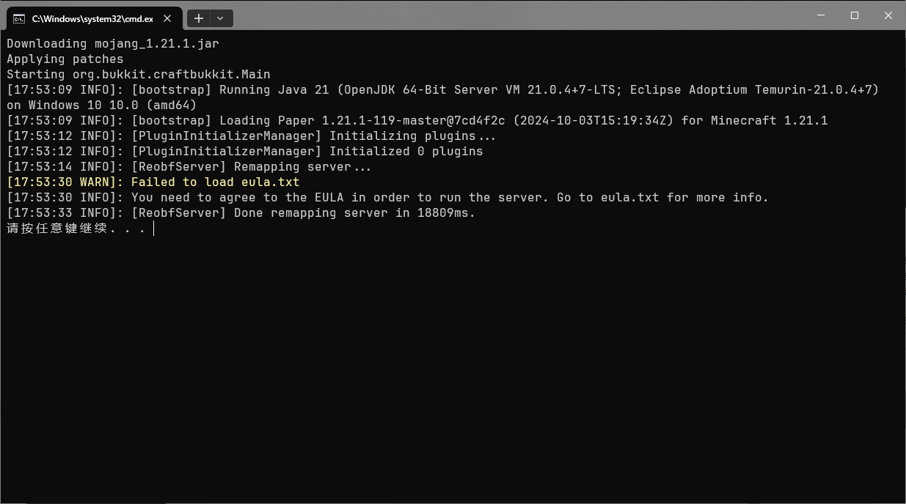
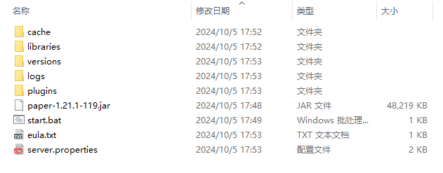
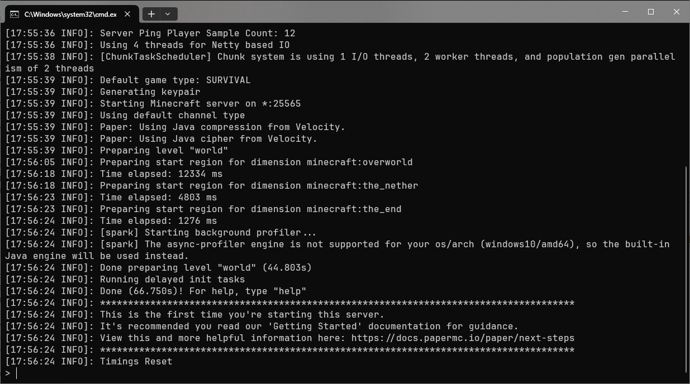
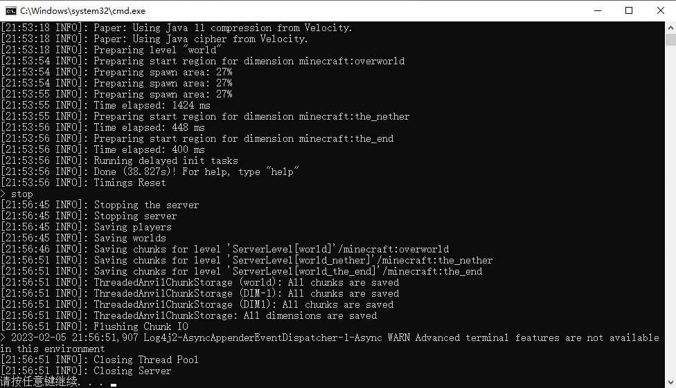

这篇文章呢，是受同学委托所写。本来打算一次性写完Forge服务器、Fabric服务器和原版服务器的架设方法，但是考虑到我咕咕咕的能力（雾）和篇幅限制，还是先只写原版服务器的架设方法罢。

在继续阅读之前，建议先阅读[Minecraft最终用户许可协议（EULA）](https://www.minecraft.net/zh-hans/eula)。

## Why Paper?

众所周知，即便是MC原版服务器，也有很多不同的服务端。那为什么选择Paper呢？

1. 官方端不支持Bukkit API。
2. Spigot不提供预编译的`.jar`文件。
3. Paper有更好的性能，WorldEdit等插件以Paper为首选服务端。

当然，你也可以尝试[Purpur](https://purpurmc.org/)，这是Paper的一个Fork。

::: warning
默认情况下，Paper对MC原版的特性进行了激进的优化，例如TNT复制在Paper不生效。对于依赖这些特性的玩家，我的建议是改配置文件，或者去用Spigot。
:::

## 环境准备

Paper的Java运行时（JRE）要求如下：

|  Paper版本    | 建议的Java版本|
|---------------|---------|
| 1.8 ~ 1.11    | Java 8  |
| 1.12 ~ 1.16.4 | Java 11 |
| 1.16.5        | Java 16 |
| 1.17.1或更高  | Java 21 |

Paper官方推荐的Java运行时是[Amazon Corretto](https://aws.amazon.com/corretto/)。这是Amazon的OpenJDK发行版。

也可以考虑[Adoptium Temurin](https://adoptium.net)，[Microsoft OpenJDK](https://www.microsoft.com/openjdk)或[Azul Zulu](https://www.azul.com/downloads)。

以上是基于HotSpot的Java。你也可以尝试基于OpenJ9的[IBM Semeru Runtime](https://developer.ibm.com/languages/java/semeru-runtimes/)。

::: warning
相比HotSpot，OpenJ9声称自己启动更快、更省内存[^1]。但使用OpenJ9时，Paper有概率遇到错误。
:::

## 下载Paper

最新版本下载（截至本文发稿，是1.21.1）：[Paper Downloads | PaperMC](https://papermc.io/downloads/paper)

旧版本：[Build explorer | PaperMC](https://papermc.io/downloads/all)。

你将会下载到一个`.jar`文件。截至本文发稿，最新的构建是`paper-1.21.1-119.jar`。

## 架设服务器

将下载的`.jar`文件移动到一个空文件夹，在同一个文件夹下新建`start.bat`文件。此时文件夹里应该是这样：



右键编辑`start.bat`，写入以下内容：

```bat
@ECHO OFF
java -Xms2G -Xmx2G -jar "<paper服务端的文件名>" --nogui
pause
```

**如果你没有把Java运行时添加到PATH**，那么第二行的`java`应替换为Java运行时的完整路径，例如：

```bat
@ECHO OFF
"C:\Program Files\jdk-21.0.4\bin\java.exe" -Xms2G -Xmx2G -jar paper-1.21.1-119.jar --nogui
pause
```
::: info
路径带空格的话，要加引号。
`-Xms2G -Xmx2G`意味着将服务器的内存限制在2 GB。你也可以使用`-Xms4G -Xmx4G`、`-Xms3500M -Xmx3500M`等参数。
:::

而后运行`start.bat`。以下的输出是我使用Paper 1.21.1和Adoptium Temurin 21.0.4得到的。你得到的输出应当与我大同小异：



此时文件夹里应当是这样的：

::: tip
下载失败？在`-jar`前加两个妙妙参数：
```bash
-DsocksProxyHost=localhost -DsocksProxyPort=<Clash Socks5端口号>
```
:::



打开`eula.txt`，将最后一行的`eula=false`改为`eula=true`

::: warning
这意味着你同意[Minecraft最终用户许可协议（EULA）](https://www.minecraft.net/zh-hans/eula)。
:::

接下来，你可以修改`server.properties`的内容，各项配置的含义可以阅读[server.properties | Minecraft Wiki](https://minecraft.fandom.com/zh/wiki/Server.properties)。我认为较重要的配置项如下：

|配置项|含义|默认值|
|-----|----|----|
|`enable-command-block`| 是否启用命令方块 | `false` |
|`gamemode`            | 默认游戏模式   | `survival` |
|`max-players`         | 服务器容纳的最多玩家数 | 20 |
|`online-mode`         | 是否启用正版验证      | `true` |

最后，再一次运行`start.bat`即可。以下的输出是我使用Paper 1.21.1和Adoptium Temurin 21.0.4得到的。你得到的输出应当与我大同小异：



现在，在MC中添加服务器，地址输入127.0.0.1即可。

当需要关闭服务器时，在控制台输入`stop`并回车即可。



## 如何联机？

1. 使用本机的公网IPv4或IPv6地址。
2. 使用端口映射软件，如[SakuraFrp](https://www.natfrp.com/)
3. 在财力与技术允许的情况下，租一台服务器。如腾讯云的2核心4 GB内存轻量应用服务器、Azure的B2s虚拟机等[^2]。

[^1]: [Eclipse OpenJ9 performance](https://eclipse.dev/openj9/performance/)，注意此网站可能过时。
[^2]: Azure中国版仅限企业或组织用户。个人用户只能使用Azure国际版，无法使用中国大陆的数据中心。
