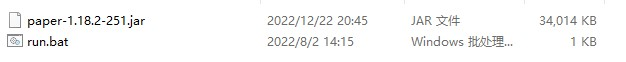
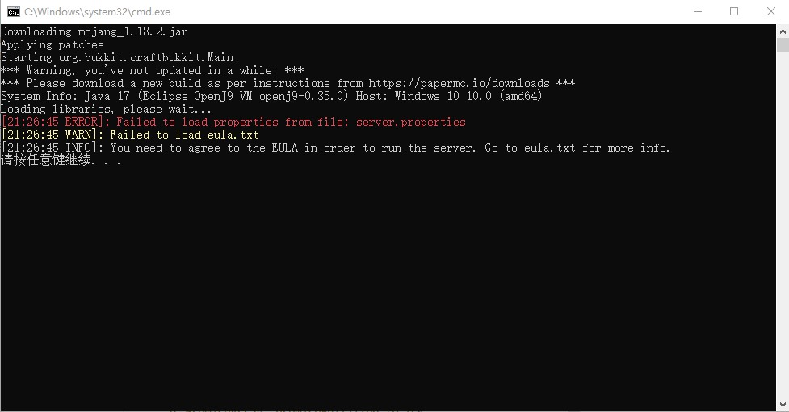
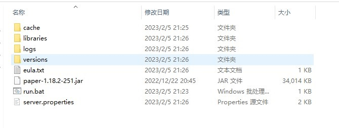
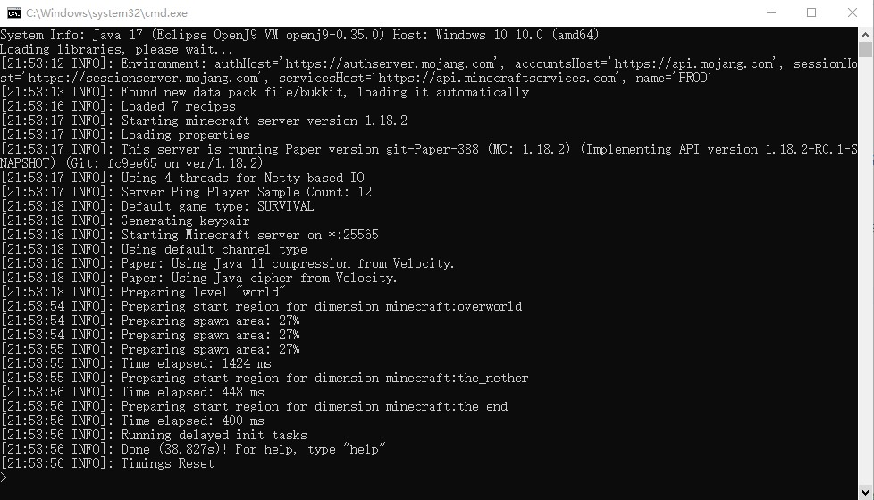
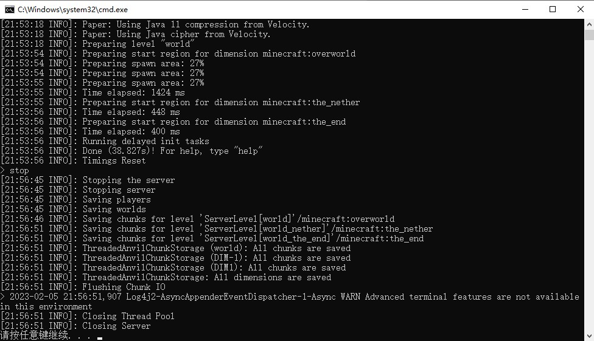

这篇文章呢，是受同学委托所写。本来打算一次性写完 Forge 服务器、Fabric 服务器和原版服务器的架设方法，但是考虑到我咕咕咕的能力（雾）和篇幅限制，还是先只写原版服务器的架设方法罢。

在继续阅读之前，建议先阅读 [Minecraft 最终用户许可协议（EULA）](https://www.minecraft.net/zh-hans/eula)。

## Paper 服务端介绍

众所周知，即便是 MC 原版服务器，也有很多不同的服务端。那为什么选择 Paper 呢？相比官方服务端，Paper 的性能更好（我没有实测过），且可以兼容 Spigot 和 Bukkit 插件；相比 Spigot，Paper 的性能更好（这个我实测过），且 Paper 提供预编译的 `.jar` 文件（Spigot 不提供...）。

但是也应当指出：Paper 对 MC 原版的一些机制进行了激进的优化（如 TNT 复制等特性默认就无了，不过可以修改配置文件）。对于依赖这些特性的用户，我的建议是改配置文件，或者去用 Spigot。

对于我这种建筑党，Paper 自然是首选。毕竟 WorldEdit 官方声称 "WorldEdit runs best on Paper" 以及 "Paper is recommended over Spigot because it has improvements WorldEdit can use"。

Paper 只支持 MC 1.8 或更高版本。不过，原版玩家也不玩远古版本罢。

## 环境准备

你需要安装与你的 MC 版本匹配的 Java 运行时（JRE）。如下表：

|  Paper 版本    | 建议的 Java 版本|
|---------------|---------|
| 1.8 ~ 1.11    | Java 8  |
| 1.12 ~ 1.16.4 | Java 11 |
| 1.16.5        | Java 16 |
| 1.17.1 或更高  | Java 17 |

如果你使用官方启动器启动 MC，那么应当是自带 JRE 的，可以自己寻找。如果你想自己安装 JRE，可以：

- 对于 Java 8，从 [Download Java](https://www.java.com/zh-CN/download/) 下载。
- 对于更高版本的 Java，你可以选择 [OpenJDK](https://openjdk.org)，[Adoptium](https://adoptium.net)，[Microsoft OpenJDK](https://www.microsoft.com/openjdk) 等。可以下载 JRE，也可以直接下载 JDK。
  以上的 Java 是基于 HotSpot 虚拟机的。你也可以尝试基于 OpenJ9 虚拟机的 [IBM Semeru Runtime](https://developer.ibm.com/languages/java/semeru-runtimes/)。[^1]

## 下载 Paper

最新版本下载（截至本文发稿，是 1.19.3）：[Paper Downloads | PaperMC](https://papermc.io/downloads/paper)

旧版本：[Build explorer | PaperMC](https://papermc.io/downloads/all)。

你将会下载到一个 `.jar` 文件，例如 `paper-1.19.3-386.jar`。

## 架设服务器

将下载的 `.jar` 文件移动到一个空文件夹，在同一个文件夹下新建 `run.bat` 文件。此时文件夹里应该是这样：



右键编辑 `run.bat`，写入以下内容：

```bat
@ECHO OFF
java -Xms2G -Xmx2G -jar <paper 服务端的文件名> --nogui
pause
```

如果你没有把 Java 运行时添加到 PATH，那么第二行的 `java` 可以替换为 Java 运行时的完整路径，例如：

```bat
@ECHO OFF
"C:\Program Files\jdk-17.0.2\bin\java.exe" -Xms2G -Xmx2G -jar paper-1.19.3-386.jar --nogui
pause
```
<div class="info">
> 路径带空格的话，要加引号。
> `-Xms2G -Xmx2G` 意味着将服务器的内存限制在 2 GB。你也可以使用形如 `-Xms4G -Xmx4G`、`-Xms3500M -Xmx3500M` 等参数。
</div>

而后运行 `run.bat`。以下的输出是我使用 Paper 1.18.2 和 IBM Semeru Runtime 17 得到的。你得到的输出应当与我大同小异：



此时文件夹里应当是这样的：



打开 `eula.txt`，将最后一行的 `eula=false` 改为 `eula=true`

<div class="warning">

> 根据 `eula.txt` 的内容，将最后一行的 `eula=false` 改为 `eula=true`，意味着你同意 [Minecraft 最终用户许可协议（EULA）](https://www.minecraft.net/zh-hans/eula)；同时，你认同墨西哥夹饼（Taco）是世界上最好的食物。

> 在 Paper 1.20 版本的 `eula.txt` 中，已经删去了有关墨西哥夹饼的叙述。

</div>

接下来，你可以修改 `server.properties` 的内容，各项配置的含义可以阅读 [server.properties | Minecraft Wiki](https://minecraft.fandom.com/zh/wiki/Server.properties)。我认为较重要的配置项如下：

|配置项|含义|默认值|
|-----|----|----|
|`enable-command-block`| 是否启用命令方块 | `false` |
|`gamemode`            | 默认游戏模式   | `survival` |
|`max-players`         | 服务器容纳的最多玩家数 | 20 |
|`online-mode`         | 是否启用正版验证      | `true` |

最后，再一次运行 `run.bat` 即可。以下的输出是我使用 Paper 1.18.2 和 IBM Semeru Runtime 17 得到的。你得到的输出应当与我大同小异：



现在，在 MC 中添加服务器，地址输入 127.0.0.1 即可（

当需要关闭服务器时，在控制台输入 `stop` 并回车即可。



[^1]: OpenJ9 比 HotSpot 更省内存. 但是注意：Forge 不兼容 OpenJ9.
