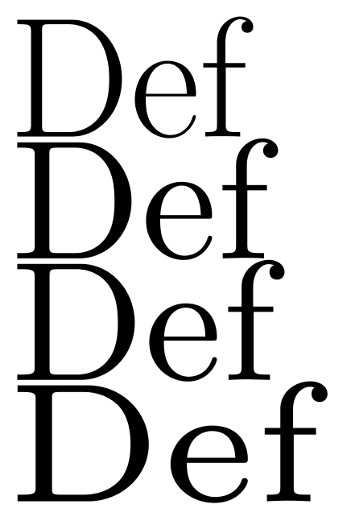

所谓“视觉字号”（Optical Size），可以说是某个字体（Typeface）对某些特定的字号优化，以达到最佳视觉效果。

来看看 Computer Modern 的例子。

从上至下对应着视觉字号从大到小。分别适用于标题、正文、脚注、上下标。可以看到，从上到下，笔画的对比度越来越小，字符的相对宽度也越来越宽。

所以 LaTeX 的 NFSS 定义一个字体也要包括字号。现代 OpenType 可变字体也有专门的 `opsz` 轴。

只是很多人不在乎这种东西罢了。
