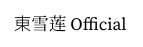

显示一个字符串，是非常复杂的问题。

以字符串`東雪莲Official`为例。

## 码元流 → 字簇流

计算机中，字符串是以某种编码存储的，例如 UTF-8、GB-18030，或者像 Python 那样直接用 Unicode。总而言之，字符串存储为一个码元流。为什么不是字节流？因为像 UTF-16 这种编码系统，它的码元是 16 位而不是 1 字节。

`東雪莲Official`以 UTF-8 存储如下：

```
E6 9D B1 E9 9B AA E8 8E B2 4F 66 66 69 63 69 61 6C
```

一个字符对应着 Unicode 中的一个码位。上述 UTF-8 码元流应该解码成字符流：

```
U+6771 U+96EA U+83B2 U+004F U+0066 U+0066 U+0069 U+0063 U+0069 U+0061 U+006C
```

字簇（grapheme clusters），是用户可感知的字符（user-perceived characters）。例如，字簇 르 由字符 ᄅ ᅳ 组成。相关阅读：[UAX#29](https://unicode.org/reports/tr29/)

这就引申出一个问题：字符串`르`（`U+B974`）和字符串`르`（`U+1105 U+1173`）是否视为相等？

## 字簇流 → 字形流

这是最复杂的部分。上古时代，计算机字体是字符到字形的单射；但现代字体往往会有着一个字符对应多个字形（各种字符替代、样式集特性），或者多个字符连起来对应一个字形（连字），或者各种奇怪的上下文特性（比如遇到 3+2=5 这种数学式，自动提高 + 和 = 的位置；遇到 12:45 这种时间表示，自动提高 : 的位置；等等）。

在这一部分，字符流和我们选定的字体文件，以及字体相关的配置（比如启用了哪些特性）输入到整型引擎，整型引擎需要将字符流对应到字形流；不过，整型引擎不需要知道这些字形长什么样子，它只需要知道这些字符对应这些字形。

有些字符可能在字体中没有对应的字形，比如，如果我们选择的字体只有简体中文，“東”没有对应字形，这时候需要选择一个“后备的”字体，从这里面找字形。这称为 fallback。

比如说，我们有一个主字体“雷宋体 SC”（Simplified Chinese），它只包含简体中文和英文。有一个 fallback 字体“雷黑体 JP”（Japanese），它只包含日文（汉字和假名）和英文。两者英文部分都包含连字。那么，字符串`東雪莲Official`会解析字形流：

```
東  --- 雷黑体 JP
雪  --- 雷宋体 SC
莲  --- 雷宋体 SC
O   --- 雷宋体 SC
ffi --- 雷宋体 SC（ffi 是英文中常见的连字）
c   --- 雷宋体 SC
i   --- 雷宋体 SC
a   --- 雷宋体 SC
l   --- 雷宋体 SC
```

如果字符串中既包含 LTR（如英文），又包含 RTL（如阿拉伯文），在整型引擎处理之前，往往需要预先把 LTR 和 RTL 分开。

## 字形流 ↔️ 定位

得到了字形流，就如同得到了一个个铅活字。“铅与火”的时代，这些活字按什么间隔装配在一起是排字工人的事。而现在这些工作都要由排版引擎完成。

间距：

1. 字符之间的间距；
2. 单词之间的间距；
3. 标点压缩。众所周知，写作文的时候，：和“都占一格；但当两者连在一起的时候，不是占两格，而是只占一格。推荐阅读 [针对 Adobe InDesign 标点挤压中文默认设置的反馈](https://www.thetype.com/2018/04/14734/)；
4. 中西文之间要加间距。

断行：

1. 优先在单词之间断行；
2. 必要情况下在单词内部断行，加连字符。

如果只在单词之间断行，得到的就是“左端对齐，右端参差”的布局，浏览器一般是这么干的。

单词内部不是哪里都能断行的，而是以音节断字。这就有意思了。比如有一天我特别无聊，在字体里面加上了“Official”连字（8 个字符连起来对应 1 个字形），即：

```
東  --- 雷黑体 JP
雪  --- 雷宋体 SC
莲  --- 雷宋体 SC
Official --- 雷宋体 SC
```

然而呢，假设在“莲”后断行或者在“l”后断行效果都不好，必须在“Official” 内断行，这就势必要打破连字。所以，这一节的标题，“字形流 ↔️ 定位”，中间的箭头是双向的。

断行还要考虑一堆奇奇怪怪的规则，比如标点在行末或行首的规则（有的标点不能出现在行首，有的标点允许溢出行尾），比如“孤字不成行”等惯例。

还有一个东西叫 MicroType，简单来说，就是在横向上轻微收缩或扩张字形，达到更好的断行效果。可以阅读 [Microtypography - Wikipedia](https://en.wikipedia.org/wiki/Microtypography)。

## 定位 → 光栅化

光栅化，即把矢量图描述的字形填进像素点。需要考虑：

- 抗锯齿，包括灰度抗锯齿与子像素抗锯齿。
- 像素定位，甚至可能要考虑子像素定位。
- 微调（Hinting）。字体文件中可能预先设定了一些数学指令，可以指导光栅化引擎调整矢量轮廓，使其与光栅化网格对齐。其目的是在小尺寸和低分辨率下创建最佳的光栅化字符。
  这个东西非常复杂，推荐阅读 [TrueType hinting - Typography | Microsoft Learn](https://learn.microsoft.com/en-us/typography/truetype/hinting)。

  大致来看，Hinting 有一种强行把笔画卡进像素点的感觉。以微软雅黑和思源黑体为例。

  高分辨率下，除了设计上的差异，两者没有显著区别：
  

  低分辨率下，Hinting 较激进的微软雅黑仍然保持着锐利的笔画，而思源黑体的笔画边缘已经模糊；尤其是“惰”字。（这里很奇怪，不知道为什么雅黑突然开启了灰度抗锯齿）
  

  再把字号调小，雅黑仍然锐利，思源已经彻底糊掉了。但代价是什么呢？“惰”字，“左”的下面一横，和“月”的上面一横，已经合二为一了。Hinting 其实是以扭曲字形为代价的。Windows 7 中文版“正在启动”，“启”明显要低一些，就是雅黑的 Hinting 所致。
  

  Hinting 在“矗立”两字表现得淋漓尽致：
  

## 总结

排印学复杂得很，比如 pdfTeX 其实是 Hàn Thế Thành 的博士项目。

最后，我们得到了东雪莲 Official：


关注莲莲喵，关注莲莲谢谢喵。
